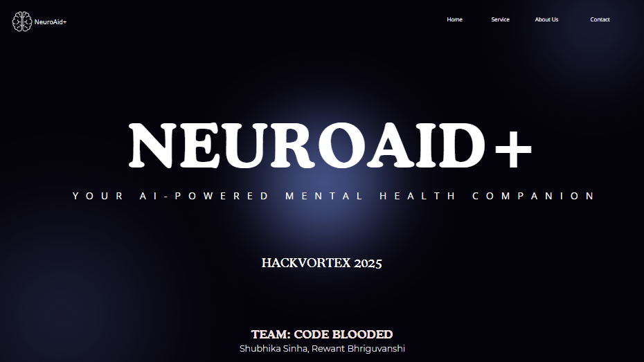
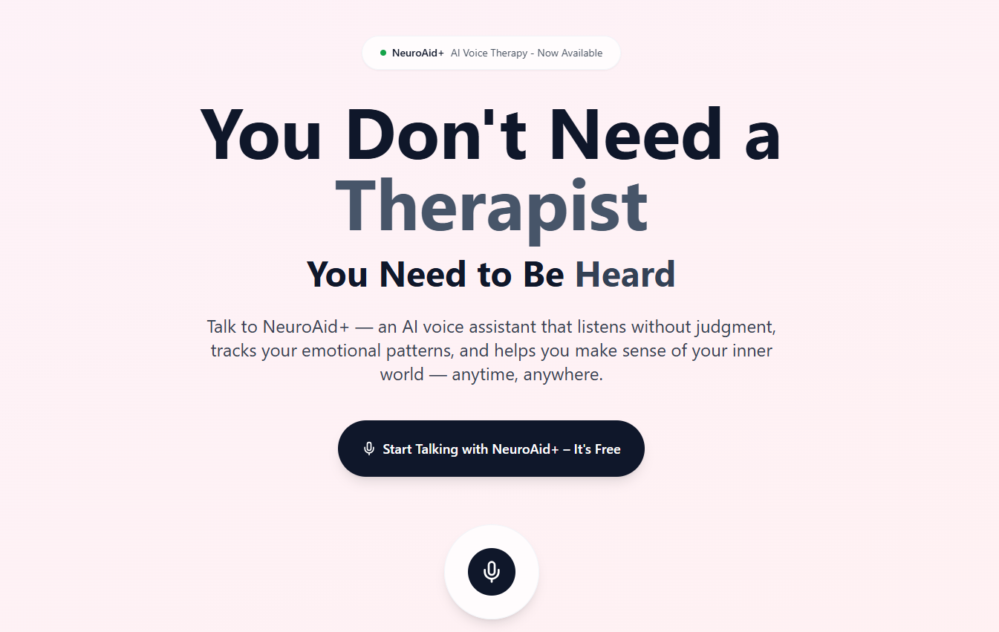
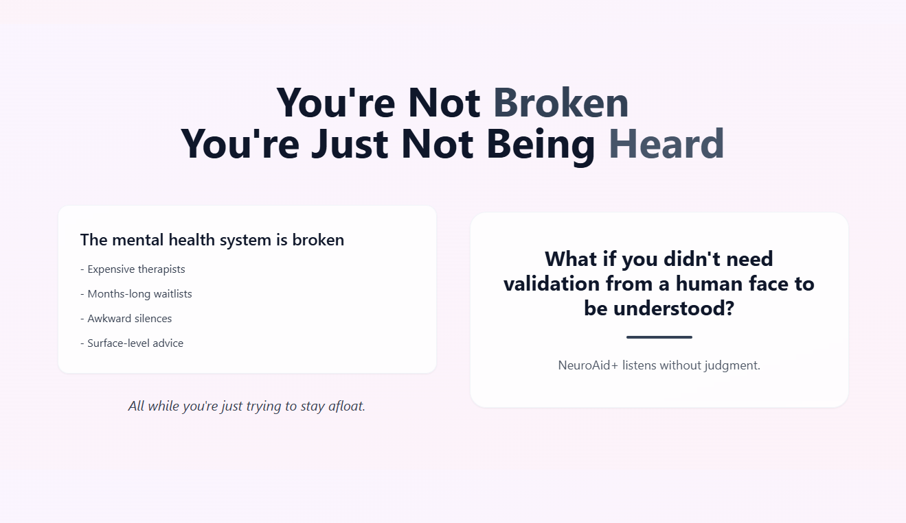
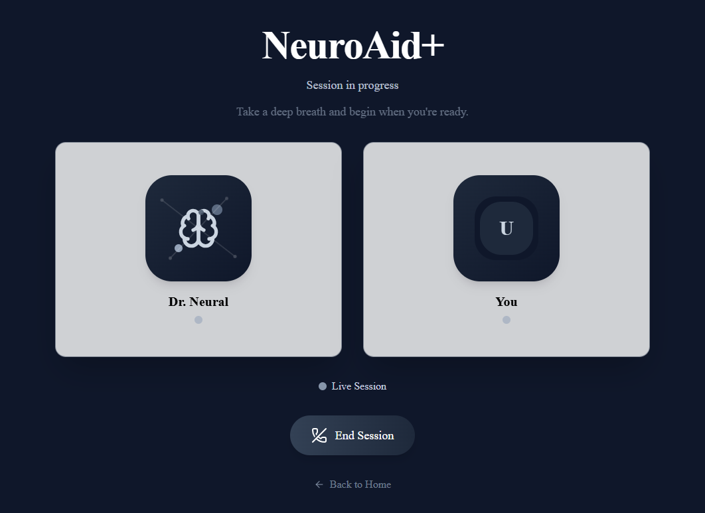
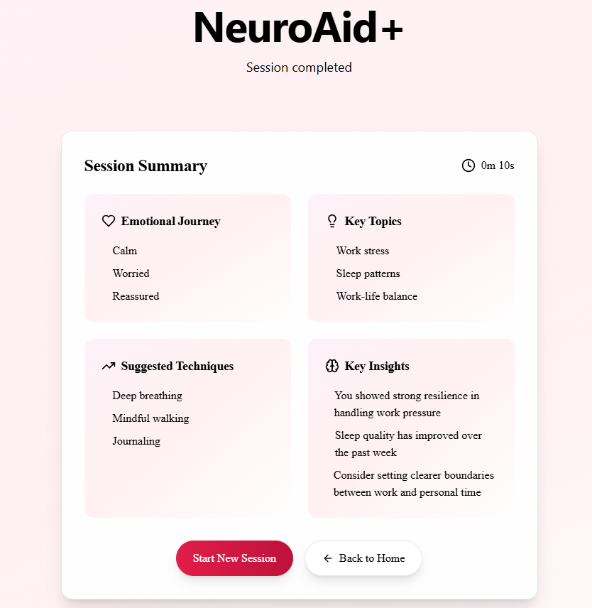

# NeuroAid+ - AI Voice Therapy Assistant



## Problem Statement

Mental health support is often inaccessible due to:
-  High therapy costs
-  Long waitlists
-  Awkward in-person sessions
-  Limited availability
-  Geographic constraints

Many people need someone to talk to but face barriers in accessing traditional therapy. This creates a gap between those who need mental health support and those who can access it.

Despite growing awareness, many individuals still suffer in silence. Students, in particular, face academic stress, social isolation, and the pressure to appear "okay" online, all while lacking someone to simply talk to.

## Approach & Solution

NeuroAid+ is an AI-powered voice therapy assistant that provides:
- Voice-first conversations that feel natural and comfortable
- Real-time emotional pattern tracking and analysis
- Private, secure, and judgment-free space for self-expression
- Immediate availability without appointments or waitlists
- Session summaries with actionable insights

## Features

### Core Features
- **Voice-First Conversations**: Natural, spoken interactions with the AI
- **Emotional Pattern Tracking**: Analysis of tone, pace, and sentiment
- **Session Summaries**: Detailed breakdowns of each conversation
- **Progress Visualization**: Track emotional growth over time
- **Privacy-Focused**: End-to-end encryption and data protection

### Session Analysis
- Emotional journey tracking
- Key topics identification
- Coping technique suggestions
- Personalized insights
- Progress metrics

### Security & Privacy
- Encrypted conversations
- Anonymized data
- No data used for training
- Secure storage
- Privacy-first approach

## Tech Stack

### Frontend
- React 18
- Vite
- TailwindCSS
- Lucide React (Icons)
- Vapi AI SDK

### Development Tools
- ESLint
- PostCSS
- Autoprefixer
- TypeScript

## Some Screenshots

### Landing Page



### Therapy Session


### Session Summary


## Run Instructions

### Prerequisites
- Node.js (v16 or higher)
- npm or yarn
- Vapi AI API key

Sure! Here's the full Markdown content, properly formatted and contained within a single `.md` file:

````markdown
# NeuroAid Installation & Setup Guide

## Step 1. Clone the Repository

```bash
git clone https://github.com/shubhikasinha/neuroAid_.git
cd agent_ai
````

## Step 2. Install Dependencies

Use either `npm` or `yarn` to install dependencies:

```bash
npm install
# or
yarn install
```

## Step 3. Create a `.env` File with Your Vapi API Credentials

This project uses the **Vapi AI SDK** to power real-time voice conversations with your AI assistant.
To make this work, you need to provide **your own Vapi credentials** in a `.env` file.

### Why Do I Need to Create This File?

Vapi provides each developer with a **unique API key and Assistant ID**, which identify:

* **Who** is making the request (you)
* **Which assistant** should respond (your assistant configuration)

We **do not include these keys in the public repository** for security reasons and to avoid misuse of any personal Vapi quota.

### 🔧 How to Set It Up

1. **Go to your Vapi AI dashboard:**
   [https://app.vapi.ai/](https://app.vapi.ai/)
   Create an account (if you haven’t already), and set up your assistant.

2. **Copy your credentials:**

   * Go to **Settings → API Keys** to get your `VAPI_PUBLIC_KEY`.
   * Go to **Assistants → \[Your Assistant]** and copy the `ASSISTANT_ID`.

3. **Create a file named `.env` in the root directory of the project.**
   Paste your credentials like this:

   ```env
   VITE_VAPI_PUBLIC_KEY=your_vapi_public_key_here
   VITE_VAPI_ASSISTANT_ID=your_assistant_id_here
   ```

## Step 4. Start the Development Server

```bash
npm run dev
# or
yarn dev
```

## Step 5. Open in Browser

Navigate to:
[http://localhost:5173](http://localhost:5173)


## Contributing

Contributions are welcome! Please feel free to submit a Pull Request.

## License

This project is licensed under the MIT License - see the [LICENSE](LICENSE) file for details.

## Acknowledgments

- Vapi AI for the voice AI technology
- The open-source community for the amazing tools and libraries
- All contributors who have helped shape this project

